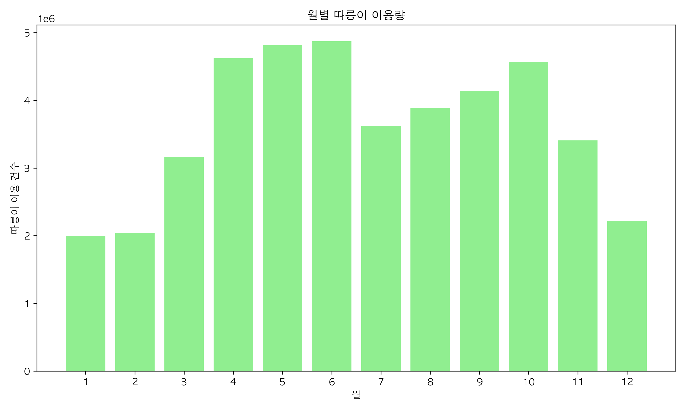
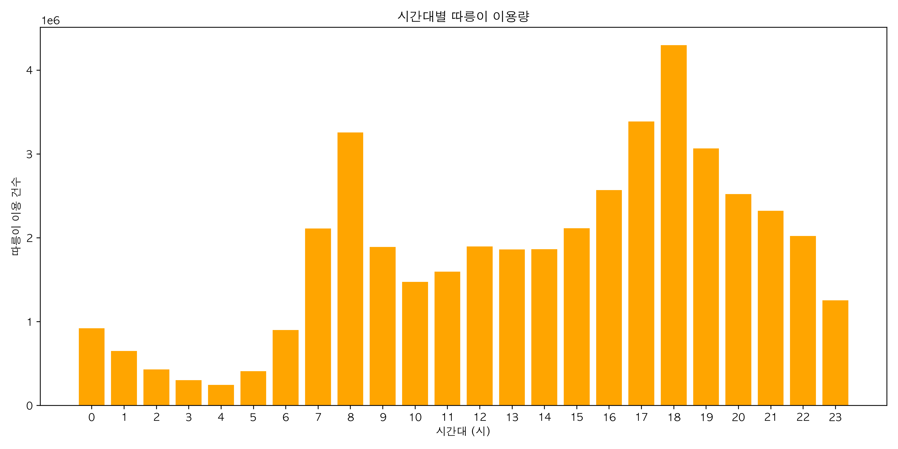
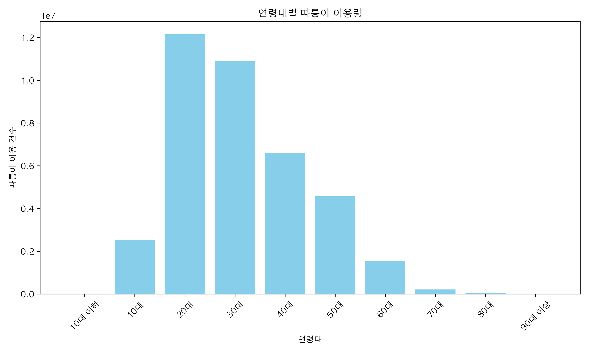
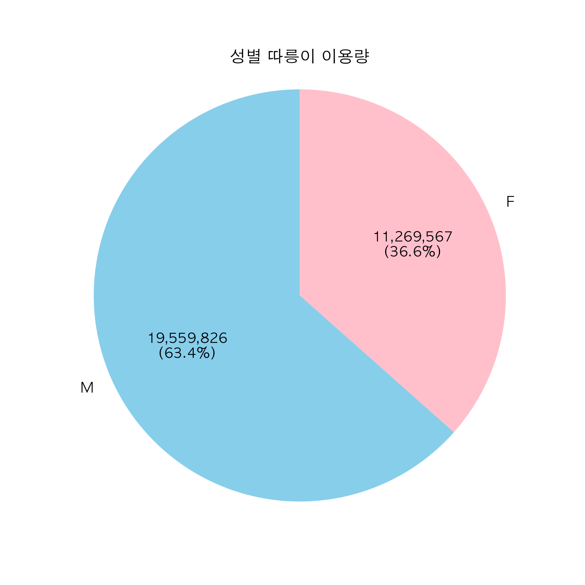
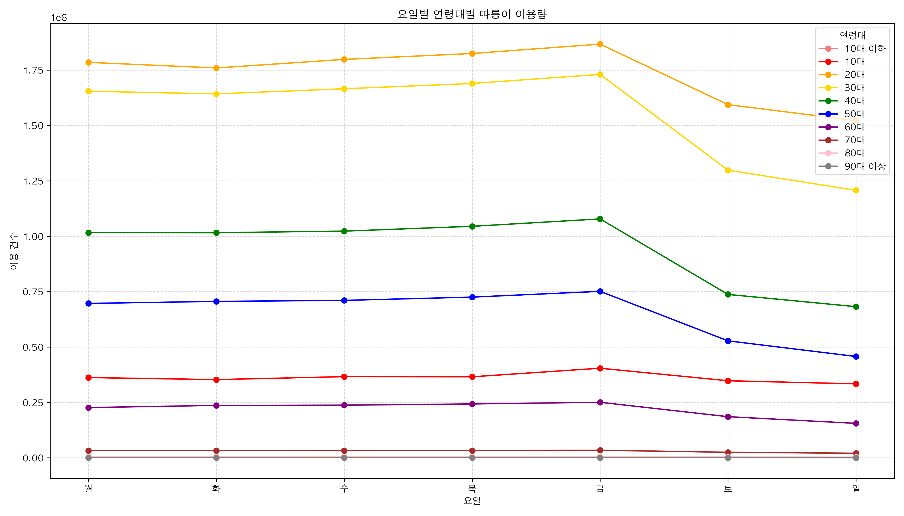
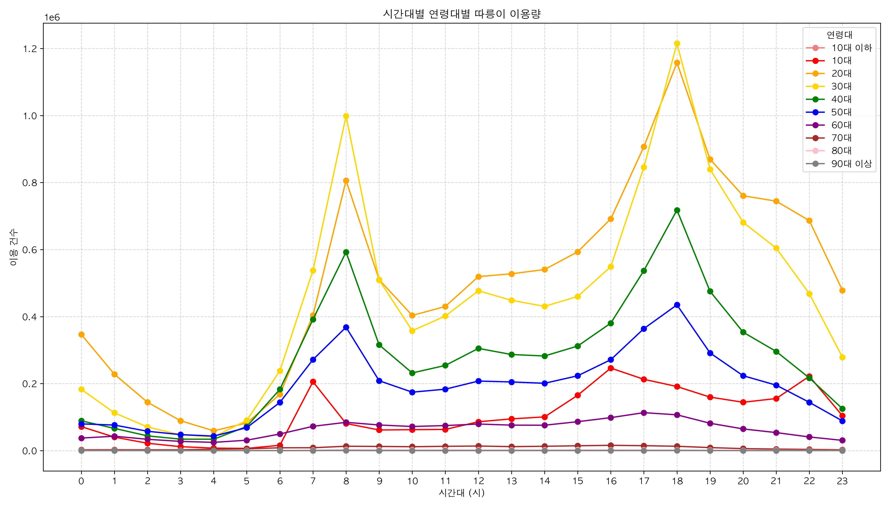
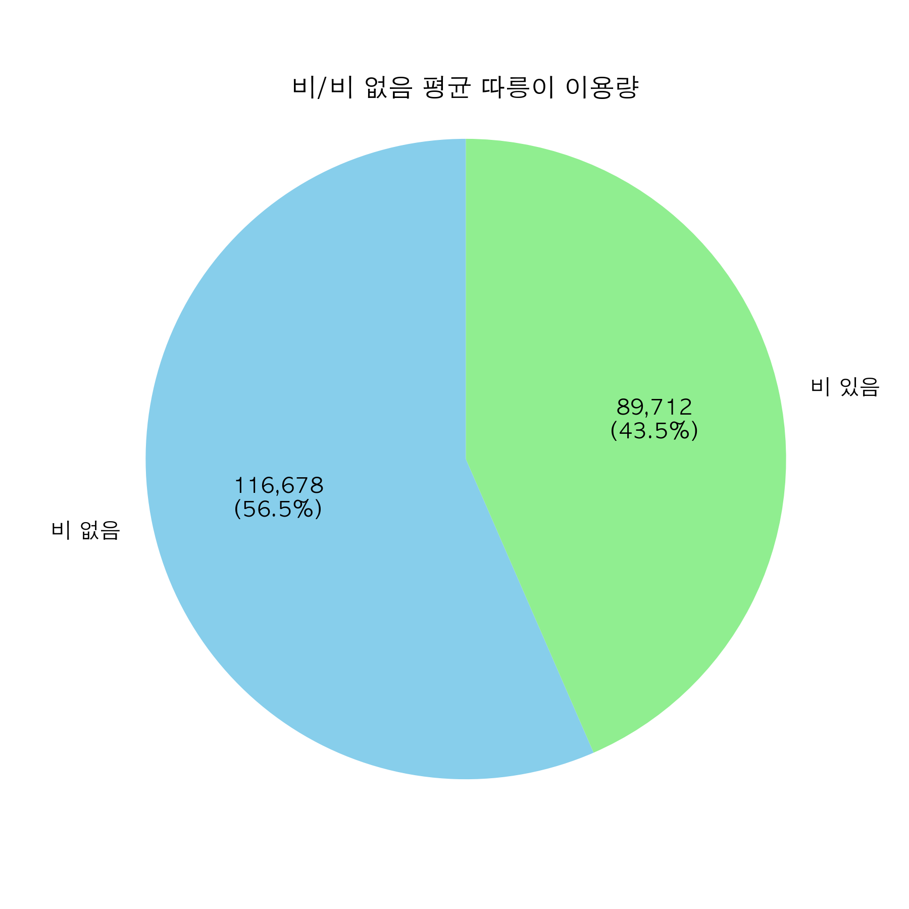
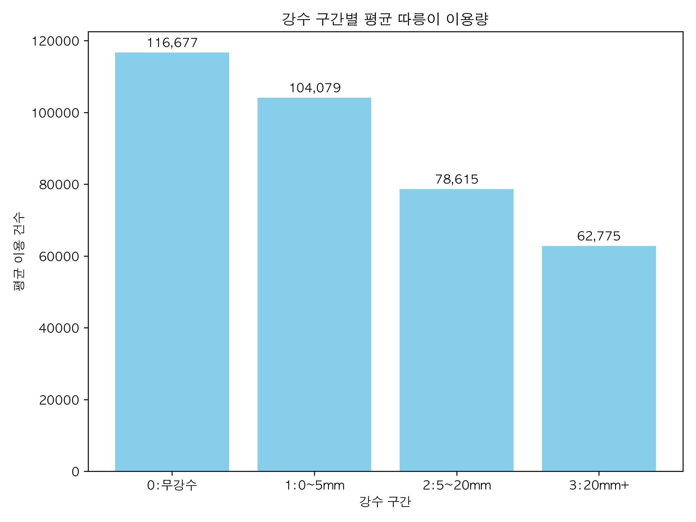

# 다양한 조건에 따른 따릉이 사용량 분석

### 이용한 데이터 및 기술
1. **서울특별시 공공자전거 대여이력 정보**
(https://data.seoul.go.kr/dataList/OA-15182/F/1/datasetView.do)
2. **서울특별시 종관기상관측ASOS 데이터**
(https://data.kma.go.kr/data/grnd/selectAsosRltmList.do?pgmNo=36&tabNo=1)
3. **skils** - python, pandas, matplotlib1. 

### 분석 내용
> **월별(계절별) 따릉이 이용량**

> **시간대별 따릉이 이용량**

> **연령대별 따릉이 이용량**

> **성별 따릉이 이용량**

> **요일X연령대별 따릉이 이용량**

> **시간X연령대별 따릉이 이용량**

> **비 유무에 따른 따릉이 이용량**

> **강수 구간별 따릉이 이용량**

